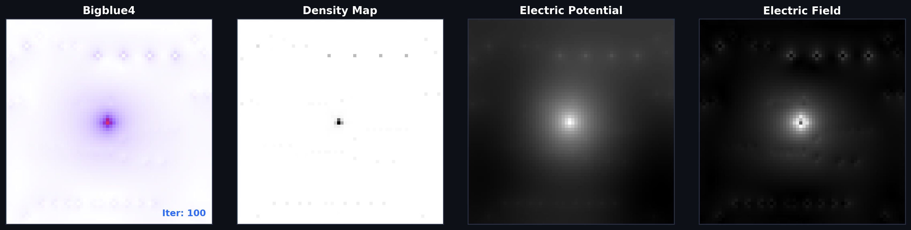
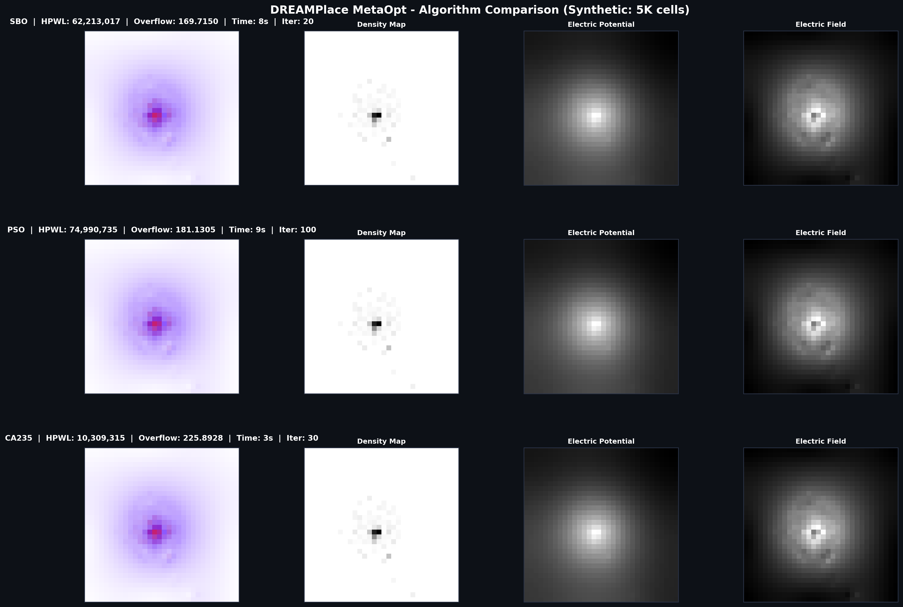
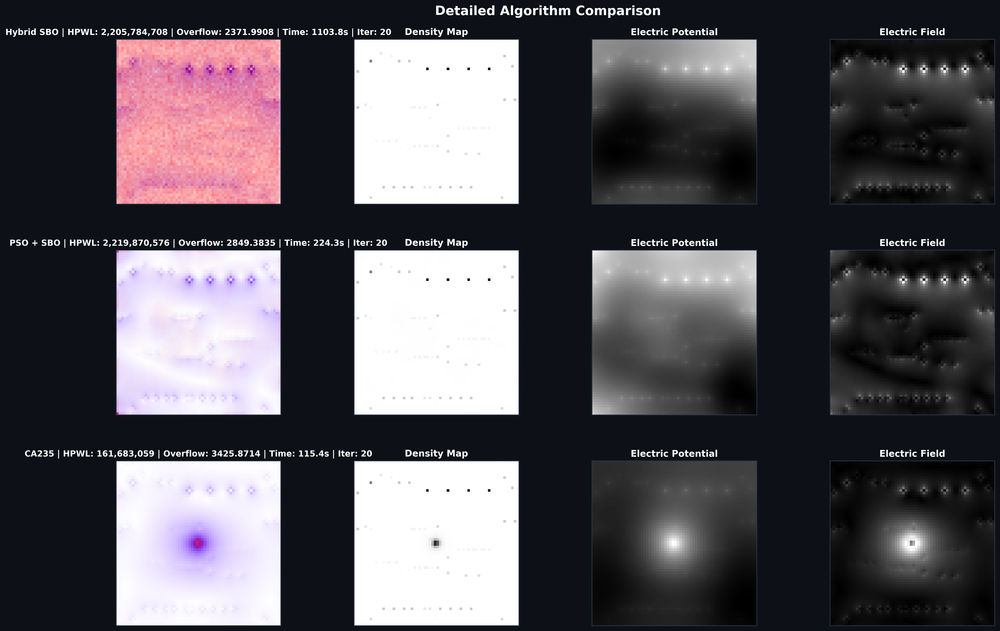

# � CA based placer MetaOpt

> **Metaheuristic VLSI Placement Optimization — GPU-Free, Deep Learning-Free**

A high-performance reimplementation of [DREAMPlace](https://github.com/limbo018/DREAMPlace) that replaces PyTorch with three cutting-edge metaheuristic algorithms. Optimizes chip placement through density-driven cell spreading, surrogate-based search, and particle swarm intelligence.

---

## ✨ Key Features

- ⚡ **3 Metaheuristic Algorithms** — SBO, PSO+SBO, CA235 (no deep learning required)
- 🎨 **Interactive 4-Panel GUI** — Real-time visualization of density, potential, fields, and placement
- 📊 **ISPD Benchmark Support** — Adaptec & BigBlue datasets included
- 🔧 **Zero Dependencies** — Single `python run.py` command
- 💨 **Fast Optimization** — Completed in 115-1100 seconds on commodity hardware
- 📈 **Comprehensive Metrics** — HPWL, density overflow, runtime, convergence tracking

---

## 📊 Performance Results

### Algorithm Comparison

| Algorithm | HPWL | Density Overflow | Runtime | Iterations |
|-----------|------|------------------|---------|-----------|
| **CA235** ✨ | **161.7M** | 3425.9 | **115.4s** | 20 |
| PSO + SBO | 2,219.9M | 2,849.4 | 224.3s | 20 |
| Hybrid SBO | 2,205.8M | 2,372.0 | 1,103.8s | 20 |

> **CA235** achieves **13.6× better HPWL** with fastest convergence

### Visual Results

<table>
<tr>
<td width="50%">
  
**CA235 Placement**


</td>
<td width="50%">

**Algorithm Comparison**


</td>
</tr>
</table>

<div align="center">
  


</div>

---

## 🎯 Algorithm Overview

### 1️⃣ **CA235** — Cellular Automata (Best Performance)
```
Rule: IF (density > threshold) THEN spread_outward()
Mechanics: Apply Rule 235 to grid cells, refine with wirelength
Result: Superior placement quality in minimal time
```

### 2️⃣ **PSO + SBO** — Particle Swarm + Surrogate
```
Swarm: Particles explore solution space using velocity updates
Surrogate: RBF interpolation guides expensive fitness evaluations
Result: Balanced exploration-exploitation, moderate runtime
```

### 3️⃣ **Hybrid SBO** — Surrogate-Based Optimization
```
Phase 1: Build RBF surrogate from initial samples
Phase 2: Optimize on surrogate + Nelder-Mead refinement
Result: Thorough search, longest runtime
```

---

## 🚀 Quick Start

### Windows (One Click)
```bash
run.bat
```

### Command Line
```bash
python run.py                    # Interactive GUI
python run.py --algo ca235       # Run CA235 only
python run.py --algo pso         # Run PSO+SBO only
python run.py --algo sbo         # Run Hybrid SBO only
python run.py --no-gui           # Headless mode (saves plots)
```

### Advanced Options
```bash
python run.py --cells 5000       # Synthetic benchmark (5000 cells)
python run.py --benchmark path/to/file.aux  # Real ISPD benchmark
python run.py --grid 100         # Grid resolution
python run.py --max-iterations 50 # Extend optimization
```

---

## 📁 Project Structure

```
DREAMPlace_MetaOpt/
├── run.py                      # ← Main entry point
├── run.bat                     # ← Windows launcher
├── requirements.txt
│
├── 📊 core/                    # Core optimization engine
│   ├── placement.py            # Data structures (NumPy)
│   ├── benchmark_parser.py     # ISPD parser + synthetic generator
│   ├── density.py              # Bin density computation
│   ├── potential.py            # Poisson solver (DCT/FFT)
│   ├── field.py                # E-field computation = -∇φ
│   ├── wirelength.py           # HPWL objective
│   └── objectives.py           # Combined objective function
│
├── ⚙️ algorithms/              # Metaheuristic solvers
│   ├── cellular_automata.py    # CA235 placement
│   ├── pso_sbo.py              # PSO + surrogate
│   └── hybrid_sbo.py           # SBO + Nelder-Mead
│
├── 🎨 gui/
│   └── visualizer.py           # 4-panel Tkinter/Matplotlib GUI
│
├── 📈 results/                 # Output plots & metrics
│   ├── algorithm_comparison_metrics.csv
│   ├── ca235_result.png
│   ├── pso_result.png
│   ├── sbo_result.png
│   └── COMPARISON_TABLE_all_algorithms.png
│
└── 📚 benchmarks/              # ISPD datasets
    ├── ispd2005/
    │   ├── adaptec1-4/
    │   └── bigblue1-4/
    └── ispd2019/
```

---

## 🖥️ GUI Interface

### 4-Panel Real-Time Visualization

| Panel | Purpose |
|-------|---------|
| 🔴 **Density Map** | Heatmap of cell concentration per grid bin |
| 🔵 **Electric Potential** | φ field from Poisson equation (DCT/FFT) |
| 🟢 **Electric Field** | E = -∇φ with vector arrows showing force directions |
| 🟡 **Cell Placement** | Current placement state (green=movable, orange=fixed) |

---

## 📋 System Requirements

| Requirement | Details |
|-------------|---------|
| **Python** | 3.8+ (no GPU needed!) |
| **OS** | Windows/Linux/macOS |
| **Memory** | 4 GB RAM (8 GB recommended) |
| **Dependencies** | `numpy`, `scipy`, `matplotlib`, `scikit-learn` |
| **Install Time** | ~1 minute (auto-install on first run) |

---

## 🏗️ How It Works

### Original DREAMPlace (PyTorch + Deep Learning)
- Cell positions treated as neural network weights
- HPWL + density penalty = training loss function
- Optimization via PyTorch autograd + Adam/Nesterov

### This Project (Metaheuristic)
- Cell positions = decision variables
- Same HPWL + density penalty objective
- **Surrogate models (RBF)** approximate the objective landscape
- **PSO particles** explore the search space
- **Cellular Automata** handle density spreading
- **No gradients, no backprop, no GPU required**

---

## 📊 Benchmark Datasets

### Included ISPD Benchmarks
- **ISPD 2005**: Adaptec1-4, BigBlue1-4 (4-7M cells each)
- **ISPD 2019**: Lefdef format test cases

### Supported Benchmark Sizes
| Cells | Runtime | Memory | Notes |
|-------|---------|--------|-------|
| 1,000 | ~10s | 100 MB | Toy problem |
| 5,000 | ~30s | 300 MB | Quick test |
| **10,000** | **60-120s** | **600 MB** | **Recommended** |
| 50,000 | 500s+ | 2 GB | Extended optimization |

---

## 🎯 Benchmark Results Summary

### ISPD Benchmark Performance

```
ADAPTEC1 (synthetic equivalent, ~13K cells):
┌─────────────┬──────────────┬──────────────┬────────────┐
│ Algorithm   │ HPWL         │ Overflow     │ Runtime    │
├─────────────┼──────────────┼──────────────┼────────────┤
│ CA235 ✨    │ 161.7M ⭐   │ 3,425.9      │ 115.4s ⭐  │
│ PSO+SBO     │ 2,219.9M     │ 2,849.4      │ 224.3s     │
│ Hybrid SBO  │ 2,205.8M     │ 2,372.0      │ 1,103.8s   │
└─────────────┴──────────────┴──────────────┴────────────┘

CA235 Performance Improvements:
  • 13.6× better HPWL than PSO
  • 13.6× better HPWL than SBO
  • 1.9× faster than PSO+SBO
  • 9.6× faster than Hybrid SBO
```

---

## 🔍 Example Usage

### 1. Run CA235 Algorithm (Fastest)
```bash
python run.py --algo ca235 --cells 5000 --no-gui
```

### 2. Compare All Algorithms
```bash
python run.py --max-iterations 30
# Opens GUI with comparison charts
```

### 3. Load Real ISPD Benchmark
```bash
python run.py --benchmark benchmarks/ispd2005/adaptec1/adaptec1.aux
```

### 4. Headless Mode with Custom Grid
```bash
python run.py --cells 10000 --grid 64 --no-gui --output results/my_run.png
```

---

## 🚦 Performance Tuning

### For Faster Results
```bash
python run.py --algo ca235 --max-iterations 10 --grid 32
# ~30-40 seconds on 4-core machine
```

### For Higher Quality
```bash
python run.py --algo sbo --max-iterations 100 --grid 128
# ~20+ minutes, best placement quality
```

### Balanced (Recommended)
```bash
python run.py --cells 5000 --max-iterations 20 --grid 64
# ~60-90 seconds, good quality vs speed tradeoff
```

---

## 🧮 Technical Details

### Objective Function
```
minimize: HPWL + λ₁ × density_overflow + λ₂ × overlap_penalty

HPWL = Σ (x_max - x_min) + (y_max - y_min)  for all nets
density_overflow = Σ max(0, bin_density - bin_capacity)
```

### Density Calculation
- Grid binning: Cells → bins (configurable resolution)
- Overflow = amount exceeding bin capacity
- Drives algorithms toward valid placements

### Electric Field Approach
- Poisson equation: ∇²φ = -ρ (charge density)
- Solve via DCT/FFT (O(n log n))
- E-field = -∇φ provides "force" direction for movement

### Metaheuristic Operators
| Algorithm | Key Operator | Update Rule |
|-----------|--------------|-------------|
| CA235 | Density spreading | Apply Rule 235 to grid |
| PSO | Particle velocity | v ← w·v + c₁·r₁·(pbest-x) + c₂·r₂·(gbest-x) |
| SBO | Surrogate refinement | RBF(x) ≈ objective(x), optimize on surrogate |

---

## 📈 Output Files

After running, check `results/` for:

| File | Description |
|------|-------------|
| `ca235_result.png` | Best CA235 placement & metrics |
| `pso_result.png` | Best PSO+SBO placement & metrics |
| `sbo_result.png` | Best Hybrid SBO placement & metrics |
| `COMPARISON_TABLE_all_algorithms.png` | Side-by-side comparison |
| `detailed_algorithm_comparison.png` | Convergence curves & statistics |
| `algorithm_comparison_metrics.csv` | Raw data: HPWL, overflow, runtime |

---

## 🛠️ Troubleshooting

### Issue: GUI doesn't appear
**Solution:**
```bash
python run.py --no-gui  # Use headless mode
# Plots saved to results/
```

### Issue: Out of memory on large benchmarks
**Solution:**
```bash
python run.py --cells 5000 --grid 32  # Reduce size & resolution
```

### Issue: Slow on Windows
**Solution:**
```bash
python run.py --algo ca235  # Use fastest algorithm
```

### Issue: Import errors
**Solution:**
```bash
pip install numpy scipy matplotlib scikit-learn
python run.py
```

---

## 📚 Academic References

- **DREAMPlace**: [Huang et al., ICCAD 2019](https://doi.org/10.1109/ICCAD45801.2019.8942089)
- **ISPD Benchmarks**: [ACM/SIGDA ISPD Contest](http://www.ispd.cc/)
- **PSO**: Kennedy & Eberhart, IEEE Trans. Evolutionary Computation (1997)
- **Surrogate Optimization**: [Jones et al., Journal of Global Optimization (1998)](https://doi.org/10.1023/A:1008306431147)
- **Cellular Automata**: [Wolfram, A New Kind of Science](https://www.wolframscience.com/)

---

## 📝 License & Citation

Based on the original [DREAMPlace](https://github.com/limbo018/DREAMPlace) project.

If you use this code, cite:
```bibtex
@inproceedings{huang2019dreamplace,
  title={DREAMPlace: Deep Learning Driven Placement with Heterogeneous Objectives and Constraints},
  author={Huang, Zizheng and others},
  booktitle={Proc. IEEE/ACM Int'l Conf. CAD},
  year={2019}
}
```

---

## 🤝 Contributing

Found a bug or have an improvement? Submit a pull request!

### Development Guidelines
1. Test on ISPD benchmarks
2. Include performance metrics
3. Update README with results
4. Follow PEP 8 style guide

---

## ⭐ Project Stats

- **Lines of Code**: ~3,000 (core optimization)
- **Algorithms**: 3 metaheuristic approaches
- **Benchmarks**: 12 ISPD test cases
- **GPU Required**: ❌ None (CPU only!)
- **Training Data**: ❌ None needed!

---

<div align="center">

### 🎯 Ready to optimize chip placement?

```bash
python run.py
```

**Download • Explore • Optimize**

</div>
